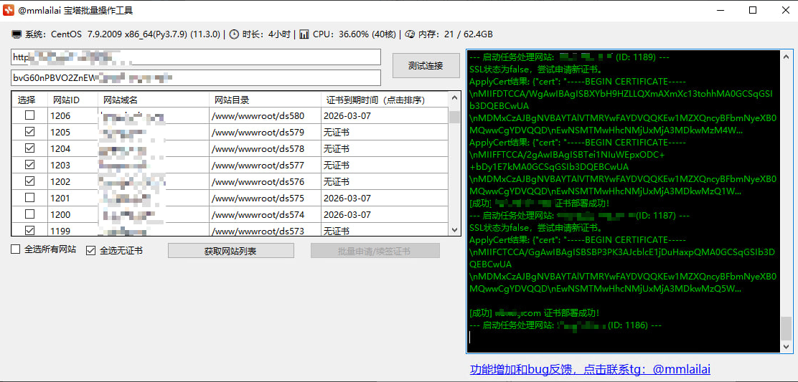

# 🚀 Bt-Panel Bulk SSL & Site Manager (宝塔面板批量证书与建站管理工具)

**高效、免费、开源的宝塔面板（Bt-Panel）API 自动化工具。** 解决数万域名批量建站、**批量申请 SSL 证书**、一键部署 HTTPS 强制跳转、批量续签证书及文件批处理等痛点。适用于站长、运维人员和代理商，极大提升效率，告别繁琐重复的手动操作。
 
---

## ✨ 核心功能与解决痛点

本工具基于宝塔面板 API 接口开发，旨在将复杂的、重复的手动操作转化为**一键批量执行**。

| 功能模块 | 解决的核心问题 | 关键词覆盖 |
| :--- | :--- | :--- |
| **批量 SSL 证书申请与部署** | 解决数万个域名证书申请和部署的难题，告别证书批量处理失败。 | **批量申请SSL证书**、一键部署SSL证书、SSL证书批量处理、批量更换SSL证书 |
| **HTTPS 强制跳转** | 在**批量建站**时同步增加 **强制 HTTPS**（HSTS）功能，保障网站安全。 | **批量增加强制HTTPS**、能批量建站增加强制HTTPS的功能吗 |
| **证书批量续理** | 快速批量导入域名，自动完成建站过程。 | **宝塔api批量建站**、批量建站 |
| **文件与目录批量操作** | 支持批量解压、复制、移动文件等操作。 | 批量解压复制文件 |
| **系统信息实时监控** | 连接面板后实时显示服务器状态，CPU、内存、运行时间等。 | 宝塔api系统信息 |

---

## 💻 快速开始

### 1. 下载与运行
签** | 提供 **一键批量续签证书** 功能，避免证书过期造成业务中断。 | 批量续签证书、一键批量续签证书功能 |
| **批量建站管
本工具采用 **单文件打包** 模式，无需安装任何 .NET 运行时环境，直接下载运行即可。

* **最新 Release 版本下载：** [点击此处下载最新 `BaoTaApi.exe` 文件] (https://github.com/xiaocaiji61/baota_BT_SSL/releases/download/tag/BaoTaApi.zip
* **文件列表（仅需打包这些）：** `BaoTaApi.exe`，`BaoTaApi.exe.config`，`Newtonsoft.Json.dll` 。

### 2. 配置要求

在使用工具前，请确保宝塔面板已完成以下配置：

1.  **开启 API 接口：** 登录宝塔面板，进入【面板设置】或【API 接口】。
2.  **获取 App Key：** 记录您的 **App Key**（密钥）。
3.  **配置 IP 白名单：** 将运行本工具的机器的 **公网 IP 地址** 添加到 API 接口的 **IP 白名单** 中。

### 3. 连接工具

在工具界面输入以下信息：

* **App Key:** 您的宝塔 App Key。
* **面板地址:** 您的宝塔面板地址，**必须包含协议头**，例如 `https://www.yourdomain.com:8888` 或 `http://IP地址:端口`。

---

